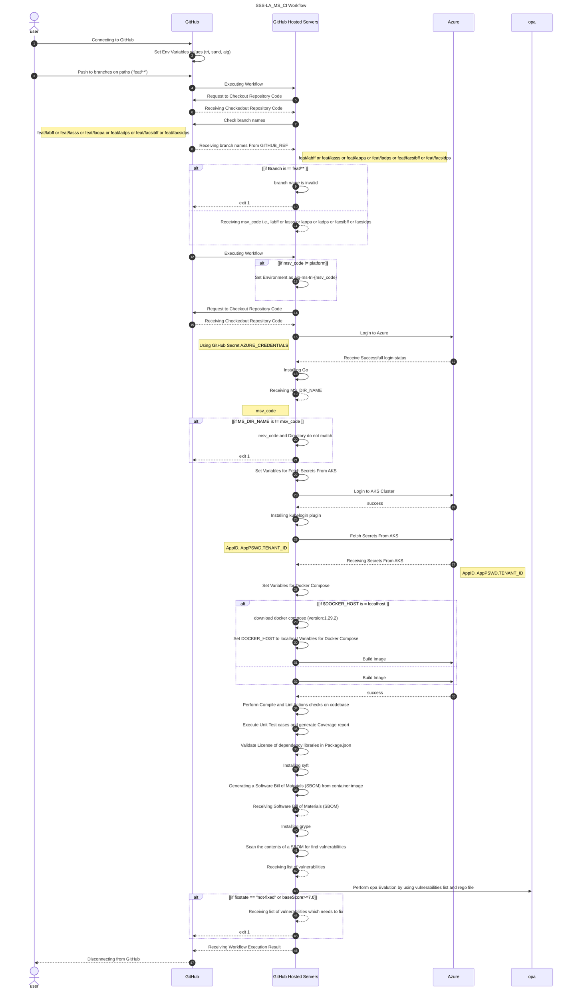

```mermaid
sequenceDiagram
actor user
participant github as GitHub
participant server  as GitHub Hosted Servers
participant azure as Azure
participant opa as opa
autonumber
title  SSS-LA_MS_CI Workflow
user ->> github: Connecting to GitHub
github ->> github: Set Env Variables values (tri, sand, aig)
user ->> github: Push to branches on paths  ('feat/**')
github ->> server: Executing Workflow
server ->> github: Request to Checkout Repository Code
github -->> server: Receiving Checkedout Repository Code
server ->> github: Check branch names
Note left of github: feat/labff or feat/lasss or feat/laopa or feat/ladps or feat/facsibff or feat/facsidps
github -->> server: Receiving branch names From GITHUB_REF
Note right of server: feat/labff or feat/lasss or feat/laopa or feat/ladps or feat/facsibff or feat/facsidps
alt [if Branch is !=  feat/** ]
  server ->> server: branch name is invalid
  server -->> github: exit 1
else
  server -->> server: Receiving msv_code i.e., labff or lasss or laopa or ladps or facsibff or facsidps
end
github ->> server: Executing Workflow
alt [if msv_code != platform]
  server ->> server: Set Environment as aig-ms-tri-{msv_code}
end
server ->> github: Request to Checkout Repository Code
github -->> server: Receiving Checkedout Repository Code
server ->> azure: Login to Azure
Note left of server: Using GitHub Secret AZURE_CREDENTIALS
azure -->> server: Receive Successfull login status
server->> server: Installing Go
server -->> server: Receiving MS_DIR_NAME
Note left of server: msv_code
alt [if MS_DIR_NAME is !=  msv_code ]
  server ->> server: msv_code and Directory do not match.
  server -->> github: exit 1
end
server ->> server: Set Variables for Fetch Secrets From AKS
server ->> azure: Login to AKS Cluster
azure -->> server: success
server ->> server: Installing kubelogin plugin 
server ->> azure: Fetch Secrets From AKS
Note left of server: AppID, AppPSWD,TENANT_ID
azure -->> server: Receiving Secrets From AKS
Note right of azure: AppID, AppPSWD,TENANT_ID
server ->> server: Set Variables for Docker Compose
alt [if $DOCKER_HOST is =  localhost ]
  server ->> server: download docker compose (version:1.29.2)
  server ->> server: Set DOCKER_HOST to localhost Variables for Docker Compose
  server ->> azure: Build Image
else
  server ->> azure: Build Image
end
azure -->> server: success
server ->> server: Perform Compile and Lint Actions checks on codebase
server ->> server: Execute Unit Test cases and generate Coverage report
server ->> server: Validate License of dependency libraries in Package.json
server ->> server: Installing syft  
server ->> server: Generating a Software Bill of Materials (SBOM) from container image
server -->>server: Receiving Software Bill of Materials (SBOM)
server ->> server: Installing grype 
server ->> server: Scan the contents of a SBOM for find vulnerabilities
server -->>server: Receiving list of vulnerabilities
server ->> opa:Perform opa Evalution by using vulnerabilities list and rego file
alt [if fixstate == "not-fixed" or baseScore>=7.0]
server -->>server: Receiving list of vulnerabilities which needs to fix 
server -->> github: exit 1
end
server -->> github: Receiving Workflow Execution Result
github -->> user: Disconnecting from GitHub
```
